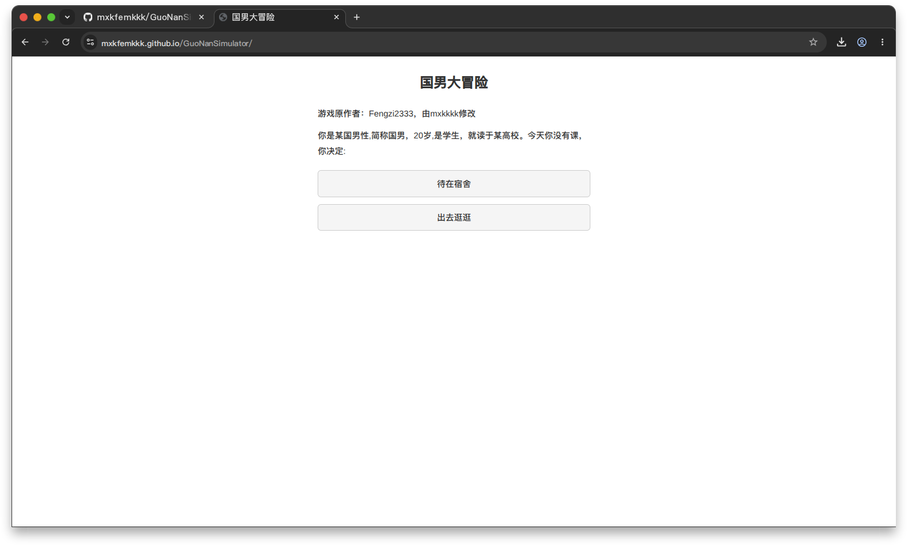

# GuoNanSimulator

> 作者：**Fengzi2333**



## 项目结构

```
index.html          # SPA 入口
data/
├── pages.js        # 页面数据 + 路由（25 个页面）
└── styles.css      # 全局样式
build.js            # 构建说明
```

## 维护指南

所有游戏内容在 `data/pages.js` 的 `PAGES` 对象中：

```js
"index": {
  texts: ["你是某国男性,简称国男..."],
  choices: [
    { text: "待在宿舍", target: "endingneet" },
    { text: "出去逛逛", target: "scenedecidebelongings" }
  ]
}
```

- `texts` — 叙述文字（每个字符串渲染为一个 `<p>`）
- `choices` — 选项按钮，`text` 为按钮文字，`target` 为目标页面名
- `endLabel` — 结局标签（可选）
- `footer` — 通关信息（可选，如 `endingfutureawaits`）

修改文本、添加选项、调整结局，直接编辑 `PAGES` 对象即可。样式在 `data/styles.css`。

## 部署

纯静态文件，推送到 GitHub Pages 即可。
